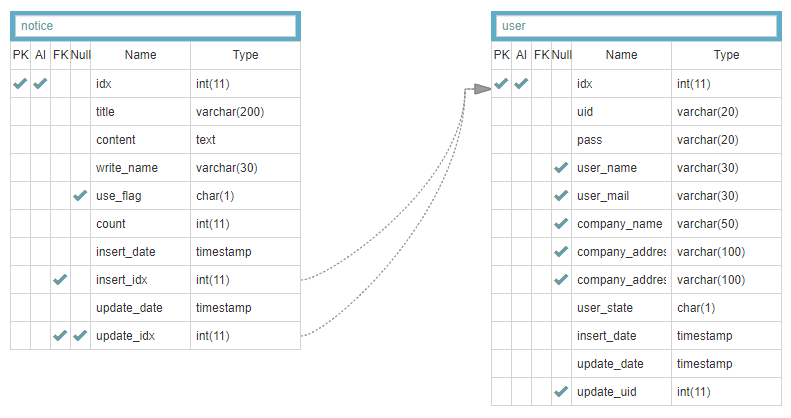

# 2020-web-test

- 회원가입, 로그인, 게시판, 페이지네이션, 게시글 정보 api 제공하는 웹서버를 만들어보았습니다.
- nodejs express, ejs로 만들었습니다.
- 로컬 작업시 db는 mariadb를 사용했습니다.
- aws ec2에 올려서 사용할때는 rds로 연결하도록 했습니다.

```json
  "scripts": {
    "start": "cross-env NODE_ENV='development' node ./web/bin/www",
    "ec2": "node ./web/bin/www"
  }
```

- 웹화면의 경우 [SB Admin](https://startbootstrap.com/templates/sb-admin/) 부트스트랩을 템플릿을 받아서 수정하였습니다.

<br><br><br>

## 데모 동영상

[](https://www.youtube.com/watch?v=VPq9A_xo2uA)

<br><br><br>

### ERD



<br><br><br>

### 디렉터리 구조

    .
    ├── node_modules/
    ├── web
    │   ├── bin
    │   │   └── www
    │   ├── public
    │   │   ├── css
    │   │   │   ├── bootstrap.min.css1
    │   │   │   ├── login.css
    │   │   │   ├── notice-write.css
    │   │   │   ├── notice.css
    │   │   │   ├── plugins.css
    │   │   │   ├── register.css
    │   │   │   └── sb-admin-2.min.css
    │   │   ├── js
    │   │   │   ├── juso-api.js
    │   │   │   ├── login.js
    │   │   │   ├── notice-detail.js
    │   │   │   ├── notice-edit.js
    │   │   │   ├── notice-write.js
    │   │   │   └── register.js
    │   │   └── vendor/
    │   ├── routes
    │   │   ├── api.js
    │   │   ├── index.js
    │   │   ├── login.js
    │   │   ├── logout.js
    │   │   ├── notice.js
    │   │   ├── register.js
    │   ├── utils
    │   │   ├── chk-session.js
    │   │   ├── error-message.js
    │   │   ├── error.js
    │   │   ├── myDAO.js
    │   │   ├── mysql.js
    │   │   └── secret.js
    │   ├── views
    │   │   ├── inc
    │   │   │   ├── footer.ejs
    │   │   │   └── sidebar.ejs
    │   │   ├── error-page.ejs
    │   │   ├── error.ejs
    │   │   ├── juso-api.ejs
    │   │   ├── login.ejs
    │   │   ├── notice-detail.ejs
    │   │   ├── notice-edit.ejs
    │   │   ├── notice-write.ejs
    │   │   ├── notice.ejs
    │   │   └── register.ejs
    │   └── app.js
    ├── .gitattributes
    ├── .gitignore
    ├── package-lock.json
    ├── package.json
    ├── README.md
    └── sqldump.sql

<br><br><br>

### 클론해서 돌려보기

- 다운받기
- 디비 생성하기 ; sqldump.sql 의 내용으로 생성
- nodejs 패키지 설치하기 `npm i`
- 도로명주소 api key 갱신하기

  ```js
  // web/views/juso-api.ejs 57번째 줄 수정하기
  var confmKey = '도로명 주소 api 키 입력하는 곳!';
  ```

- 웹서버 실행하기 `npm start`
- 브라우저로 접속하기 http://localhost:3000

<br><br><br>

### 버그

- 이름 유효성 검사 없음
- 비밀번호 대소문자 구분 없음

<br><br><br>

<hr>
<hr>

<br><br><br>

### 도로명 주소 api 신청방법

https://www.juso.go.kr/addrlink/devAddrLinkRequestWrite.do?returnFn=write&cntcMenu=URL

- 딱히 기업에 들어가 있지 않아도 발급 받을 수 있다.
- 서비스 용도를 개발로 고르면 7, 30, 90일 선택하여 발급받을 수 있다.
- 이때 발급받은 키는 다시 확인이 불가하니 꼭 메모한다.

<br><br><br>

### express-generator

- express 템플릿.
- express 프로젝트를 시작할때 디렉터리 구조를 잡아줌
- 하는 방법

  - express-generator 패키지 전역 설치`npm install express-generator -g`
  - express 프로젝트 생성 `express --view=ejs myExpressApp`
  - 아래와 같은 프로젝트가 만들어 진다.
    ```
        root
        ├── bin
        │ └── www
        ├── public
        │ ├── images
        │ ├── javascripts
        │ └── stylesheets
        │ └── style.css
        ├── routes
        │ ├── index.js
        │ └── users.js
        ├── views
        │ ├── error.ejs
        │ └── index.ejs
        ├── app.js
        └── package.json
    ```
  - 열심히 편집한다.

<br><br><br>
